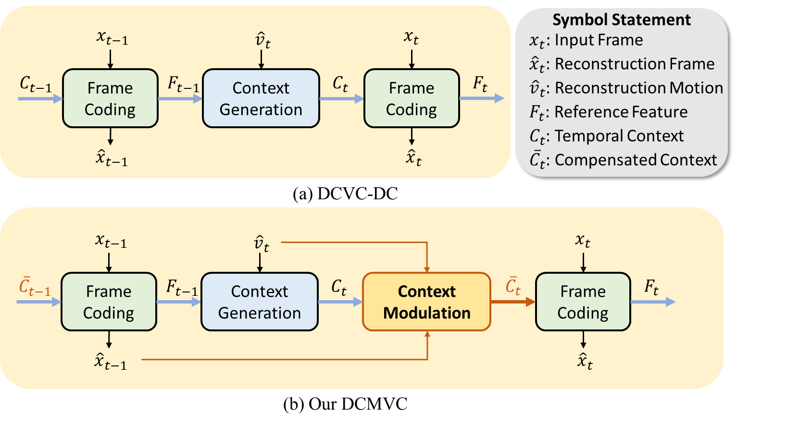
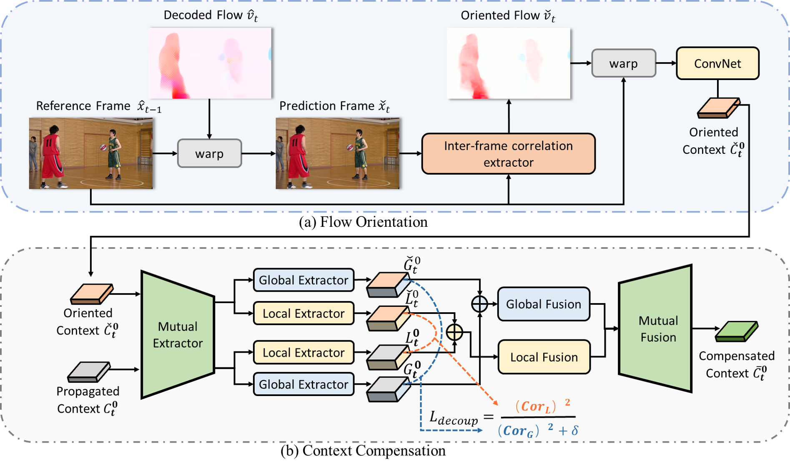
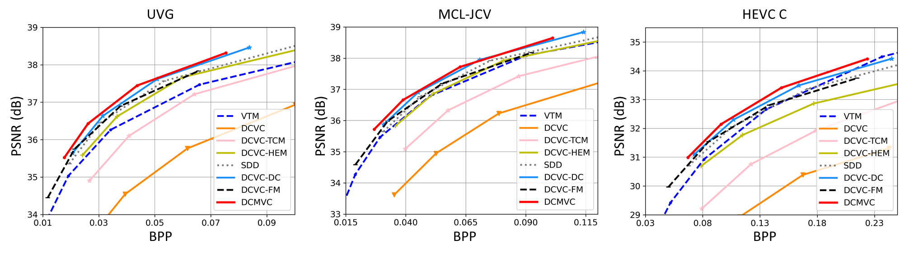
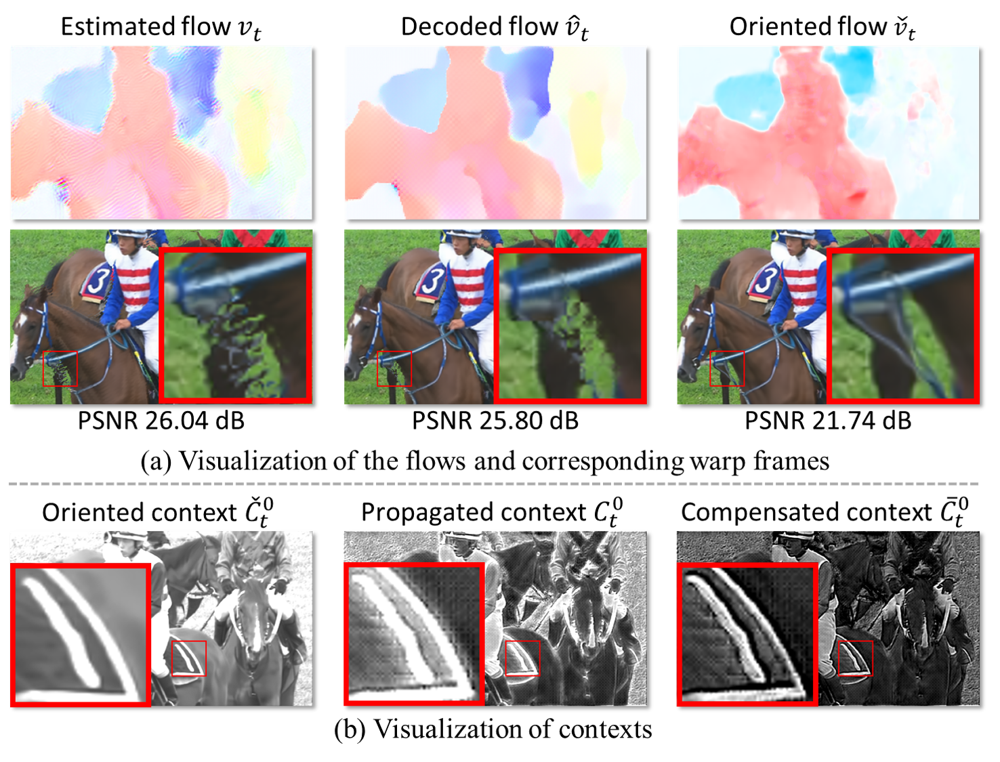

<div align="center">

# Neural Video Compression with Context Modulation [CVPR 2025]

Chuanbo Tang, Zhuoyuan Li, Yifan Bian, Li Li, Dong Liu

[[`Arxiv`](https://arxiv.org/abs/2505.14541)] [[`BibTeX`](#book-citation)] [[`Dataset`](https://github.com/EsakaK/USTC-TD)] 

[](https://www.python.org/downloads/release/python-380/) [](https://pytorch.org/get-started/locally/) [](#license)

</div>


## 📌Overview

Our **D**eep **C**ontext **M**odulation for **V**ideo **C**ompression (**DCMVC**) significantly advances the performance of Neural Video Codecs (NVCs). DCMVC is proposed to generate high-quality temporal context exploiting the reference information in both pixel and feature domain.
<div align="center">

</div>

- **Flow Orientation**: It enables our DCMVC to generate additional oriented temporal context from the reference frame. 
- **Context Compensation**: It eliminates the irrelevant propagated information to ensure better context modeling. 
<div align="center">

</div>


## :bar_chart: Experimental Results

### Main Results
Results comparison (BD-Rate and RD curve) for PSNR. The Intra Period is 32 with 96 frames. The anchor is VTM-13.2 LDB
<div align="center">

|                                                              |   UVG    |   MCL-JCV   |     HEVC_C     |
| :----------------------------------------------------------: | :---------: | :---------: | :---------: |
| [DCVC-DC](https://openaccess.thecvf.com/content/CVPR2023/papers/Li_Neural_Video_Compression_With_Diverse_Contexts_CVPR_2023_paper.pdf) |   -25.9   |   -14.4   |   -8.8   |
| [DCVC-FM](https://openaccess.thecvf.com/content/CVPR2024/papers/Li_Neural_Video_Compression_with_Feature_Modulation_CVPR_2024_paper.pdf) |   -20.4   |   -8.1   |   -8.4   |
|                       **DCMVC (ours)**                        | **-30.6** | **-17.3** | **-14.4** |

</div>


### Visualizations

- Our DCMVC enables better temporal context modeling.

<div align="center">

</div>


## Installation

This implementation of DCMVC is based on [DCVC-DC](https://github.com/microsoft/DCVC/tree/main/DCVC-family/DCVC-DC) and [CompressAI](https://github.com/InterDigitalInc/CompressAI). Please refer to them for more information.

<details>
  <summary><font size="5">1. Install the dependencies</font></summary><br>

```shell
conda create -n $YOUR_PY38_ENV_NAME python=3.8
conda activate $YOUR_PY38_ENV_NAME

conda install pytorch==1.10.0 torchvision==0.11.0 cudatoolkit=11.3 -c pytorch
pip install pytorch_ssim scipy matplotlib tqdm bd-metric pillow pybind11
```

</details>

<details>
  <summary><font size="5">2. Prepare test datasets</font></summary><br>

For testing the RGB sequences, we use [FFmpeg](https://github.com/FFmpeg/FFmpeg) to convert the original YUV 420 data to RGB data.

A recommended structure of the test dataset is like:

```
test_datasets/
    ├── HEVC_B/
    │   ├── BQTerrace_1920x1080_60/
    │   │   ├── im00001.png
    │   │   ├── im00002.png
    │   │   ├── im00003.png
    │   │   └── ...
    │   ├── BasketballDrive_1920x1080_50/
    │   │   ├── im00001.png
    │   │   ├── im00002.png
    │   │   ├── im00003.png
    │   │   └── ...
    │   └── ...
    ├── HEVC_C/
    │   └── ... (like HEVC_B)
    └── HEVC_D/
        └── ... (like HEVC_C)
```

</details>

<details>
  <summary><font size="5">3. Compile the arithmetic coder</font></summary><br>

If you need real bitstream writing, please compile the arithmetic coder using the following commands.

> On Windows

```
cd src
mkdir build
cd build
conda activate $YOUR_PY38_ENV_NAME
cmake ../cpp -G "Visual Studio 16 2019" -A x64
cmake --build . --config Release
```

> On Linux

```
sudo apt-get install cmake g++
cd src
mkdir build
cd build
conda activate $YOUR_PY38_ENV_NAME
cmake ../cpp -DCMAKE_BUILD_TYPE=Release
make -j
```

</details>


## :rocket: Usage

<details>
  <summary><font size="5">1. Evaluation</font></summary><br>

Run the following command to evaluate the model and generate a JSON file that contains test results. 

```shell
python test.py --rate_num 4 --test_config ./dataset_config_example_rgb.json --cuda 1 --worker 1 --output_path output.json --i_frame_model_path ./ckpt/cvpr2023_image_psnr.pth.tar --p_frame_model_path ./ckpt/dcmvc_p_frame.pth.tar
```

- We use the same Intra model as DCVC-DC. `cvpr2023_image_psnr.pth.tar` can be downloaded from [DCVC-DC](https://github.com/microsoft/DCVC/tree/main/DCVC-family/DCVC-DC).
- Our `dcmvc_p_frame.pth.tar` can be downloaded from [CVPR2025-DCMVC](https://pan.baidu.com/s/1Hy3xKBmRIxFgOyv3v930hw?pwd=7q21).

Our model supports variable bitrate. Set different `i_frame_q_indexes`  and `p_frame_q_indexes` to evaluate different bitrates.

</details>


</details>

## :book: Citation

**If this repo helped you, a ⭐ star or citation would make my day!**

```bibtex
@InProceedings{tang2025neural,
    author    = {Tang, Chuanbo and Li, Zhuoyuan and Bian, Yifan and Li, Li and Liu, Dong},
    title     = {Neural Video Compression with Context Modulation},
    booktitle = {Proceedings of the Computer Vision and Pattern Recognition Conference (CVPR)},
    month     = {June},
    year      = {2025},
    pages     = {12553--12563}
}
```

## :email: Contact

If you have any questions, please contact me: 

- cbtang@mail.ustc.edu.cn 

## License

This work is licensed under MIT license.

## Acknowledgement

Our work is implemented based on [DCVC-DC](https://github.com/microsoft/DCVC/tree/main/DCVC-family/DCVC-DC) and [CompressAI](https://github.com/InterDigitalInc/CompressAI).


